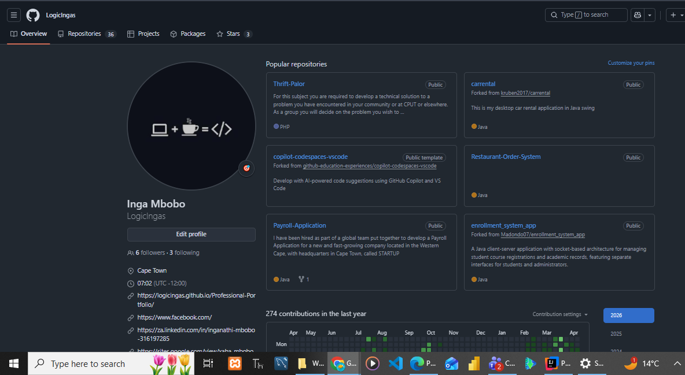

# 👋 Hi, I'm Inganathi Mbobo  
### 🎓 Final Year ICT Student | 💻 Applications Development  

📍 Cape Town, South Africa  
📧 230711723@mycput.ac.za  
📞 0699279438  

---

# 🧠 Professional Profile

Results-driven Applications Development student with a strong foundation in Java, Python, and modern web technologies. Skilled in designing and developing scalable, user-focused applications using Agile methodologies. Demonstrates strong problem-solving abilities, attention to detail, and a commitment to continuous learning. Passionate about building innovative solutions that address real-world challenges.

---

# 🛠️ Technical Skills

## 💻 Programming Languages
- Java  
- Python  
- PHP  
- SQL  

## 🌐 Web Technologies
- HTML5  
- CSS3  
- JavaScript  

## ⚙️ Tools & Frameworks
- React  
- Spring Boot  
- Git  
- GitHub  

---

# 🎥 Mock Interview & Professional Introduction

👉 [Watch My Mock Interview](https://drive.google.com/file/d/1r3BA0biYKo8JwFmfVXzXpuGweJDtHKXR/view)

---

# 🎓 Education

**Diploma in ICT (Applications Development)**  
Cape Peninsula University of Technology | 2024 – Present  

**Higher Certificate in Information Technology**  
Cape Peninsula University of Technology | 2023  

---

# 🛠️ Projects

## 🛍️ Community Marketplace Application *(Group Leader)*
- Led a team of six in the design and development of a scalable marketplace platform  
- Coordinated sprint planning, task allocation, and risk management  
- Resolved Git merge conflicts to maintain workflow efficiency  
- Applied Agile methodologies to deliver project milestones on time  

## 👕 Local Community E-commerce Platform *(Lead Developer)*
- Designed and implemented a clothing marketplace system  
- Developed product catalog and user interaction functionality  
- Applied UI/UX design principles to improve usability and accessibility  
- Integrated frontend and backend components  

---

# 💼 Experience

**Student Developer**  
Cape Peninsula University of Technology | 2023 – Present  

- Developed full-stack applications using Java, Spring Boot, and React  
- Applied Agile and Scrum methodologies in collaborative environments  
- Produced technical documentation aligned with PMBOK standards  
- Utilised GitHub for version control and team collaboration  

---

# 📎 Supporting Documents

📄 [View Academic Record](./documents/Inga_Mbobo_Academic_Record.pdf)

---

# 📸 Evidence Section

## GitHub Repository

---

# 🌐 GitHub Pages Publication

## 🔗 Live Portfolio
👉 https://logicingas.github.io/Professional-Portfolio/

---

## ⚙️ Steps Taken
- Created a GitHub repository for the digital portfolio  
- Structured content using Markdown in a README.md file  
- Uploaded and managed files using Git version control  
- Enabled GitHub Pages for public access  
- Selected the main branch as the deployment source  
- Verified successful deployment and accessibility  

---

# 🧾 Reflection: GitHub Student Account (STAR Method)

## ⭐ Situation
As part of my academic development, I was required to establish a professional GitHub presence.

## 🎯 Task
To effectively use GitHub as a platform to showcase my projects, technical skills, and growth.

## ⚙️ Action
I uploaded and maintained structured repositories, documented my work clearly, and used version control practices consistently. I also included my mock interview video as supporting evidence of my professional communication skills.

## ✅ Result
I developed a strong GitHub profile that demonstrates both my technical ability and professionalism, making it easier for lecturers and potential employers to assess my capabilities.

---

# 💻 Reflection: Coding Journey (STAR Method)

## ⭐ Situation
During my Applications Development studies, I was introduced to multiple programming languages and development frameworks.

## 🎯 Task
To build strong programming skills and apply them effectively to real-world scenarios.

## ⚙️ Action
I practiced coding consistently, worked on academic and personal projects, and collaborated with peers using GitHub. I explored technologies such as Java, Python, and web development while applying Agile practices.

## ✅ Result
I improved my problem-solving skills and gained confidence in developing complete applications, from design to implementation.

---

# 🎤 Reflection: Mock Interview (STAR Method)

## ⭐ Situation
I participated in a mock interview as preparation for entering the professional workplace.

## 🎯 Task
To present myself professionally and communicate my technical knowledge effectively.

## ⚙️ Action
I prepared structured responses, practiced common interview questions, and clearly explained my projects and technical skills during the interview.

## ✅ Result
I improved my communication and presentation skills, increased my confidence, and identified areas for further improvement.

---

# 🌍 Reflection: GitHub Pages (STAR Method)

## ⭐ Situation
I was required to publish my digital portfolio online using GitHub Pages.

## 🎯 Task
To create an accessible and professional online portfolio.

## ⚙️ Action
I configured GitHub Pages, ensured proper repository structure, and successfully deployed my portfolio.

## ✅ Result
I published a live portfolio that enhances my professional visibility and allows others to easily access and evaluate my work.

---

# 📈 GitHub Stats & Activity

---

# 🚀 Final Thoughts

This digital portfolio represents my growth as an Applications Development student. It highlights my technical skills, project experience, and ability to present myself professionally. I am prepared to apply my knowledge in real-world environments and continue developing as a software developer.
